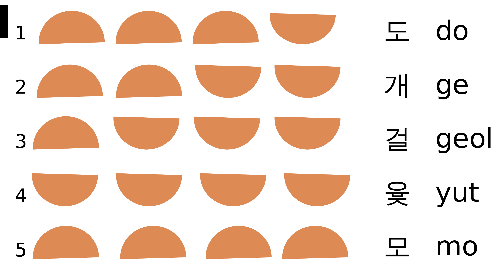

Yut Game (Four Sticks Game) Kata
=================

Yutnori is a traditional Korean game that is played with four sticks called Yut (acting as dice), a game board, and playing pieces. The players take turns throwing the Yut sticks and moving their playing pieces along the game board based on the outcome of the throw. The game is won when a player has taken all their tokens from the start to the end of the board.

This kata is an adaptation of the game designed to practice TDD.

Your task
------------

Your task is to create a program that simulates the game of Yutnori. The program should allow two players to take turns throwing sticks and moving their playing pieces along a simplified game board. 
- Each player has the following commands available each turn:
```
Playerx.Throw
Playerx.Move(playingPiece)
```
The game board state should be shown after each round, and the game should end when one player has taken all their playing pieces across the board.


## Requirements
# Game Board and Game Pieces:
For the purposes of this kata, the game board has been simplified to a one-dimensional array of 15 squares.
```
[[][][][][][][][][][][][][][][]]
```
For the purposes of this kata, we will use two playing pieces per player. The playing pieces are represented as follows:
```
- Player1Pieces = [+(1),+(2)]
- Player2Pieces = [-(1),-(2)]
```

# Game Play:
- Players take turns throwing four sticks, which can land with either the flat side up (-) or the rounded side up (x).
- Each possible combination of stick throws is associated with a different move on the game board as follows:
```
Do -xxx Move 1 space
Ge --xx Move 2 spaces
Geol ---x Move 3 spaces
Yut ---- Move 4 spaces (get another throw)
Mo xxxx Move 5 spaces (get another throw)
```
The order or exact match of the sticks does not matter. For example, x-xx counts as Do, x-x- counts as Gae, and --x- counts as Gul.



- The player moves their token on the game board based on the outcome.
- All playing pieces start off the board
- The player can decide to either move one piece several times or move multiple pieces.
- If a player's piece lands on a space already occupied by another player's piece, the latter is sent back to the starting point.
- The winner is the first player to move all their pieces to the endpoint on the opposite side of the board.

## Example
You may use this example as a basis for your acceptance test
```
$[[][][][][][][][][][][][][][][]]
$Player1's turn
>Player1.Throw()
$The throw is Geol ---x
>Player1.Move(Piece1)
$[[][][+(1)][][][][][][][][][][][][]]
$Player2's turn
>Player2.Throw()
$The throw is Yut ----
>Player2.Move(Piece1)
$[[][][+(1)][-(1)][][][][][][][][][][][]]
$Player2's turn
>Player2.Throw()
$The throw is Mo xxxx
>Player2.Move(Piece1)
$[[][][+(1)][][][][][][-(1)][][][][][][]]
$Player2's turn
>Player2.Throw()
$The throw is Geol ---x
>Player2.Move(Piece2)
$[[][][-(2)][][][][][][-(1)][][][][][][]]
$Player1's turn
>Player1.Throw()
$The throw is Do -xxx
>Player1.Move(Piece1)
$[[+(1)][][-(2)][][][][][][-(1)][][][][][][]]
$Player2's turn
>Player2.Throw()
$The throw is Yut ----
>Player2.Move(Piece1)
$[[+(1)][][-(2)][][][][][][][][][][-(1)][][]]
$Player2's turn
>Player2.Throw()
$The throw is Geol ---x
>Player2.Move(Piece1)
$[[+(1)][][-(2)][][][][][][][][][][][][]]
$Player1's turn
>Player1.Throw()
$The throw is Do -xxx
>Player1.Move(Piece2)
$[[+(1),+(2)][][-(2)][][][][][][][][][][][][]]
$Player2's turn
>Player2.Throw()
$The throw is Mo xxxx
>Player2.Move(Piece2)
$[[+(1),+(2)][][][][][][][-(2)][][][][][][][]]
$Player2's turn
>Player2.Throw()
$The throw is Mo xxxx
>Player2.Move(Piece2)
$[[+(1),+(2)][][][][][][][][][][][][-(2)][][]]
$Player2's turn
>Player2.Throw()
$The throw is Yut ----
>Player2.Move(Piece2)
$[[+(1),+(2)][][][][][][][][][][][][-(2)][][]]
$The winner is Player2
```

##Bonus
- Allow the game board to be configured to any size
- Allow the number of playing pieces to be configured
- Pieces are automatically stacked when they land on the same square and are moved together

More Info:
https://en.wikipedia.org/wiki/Yut
https://static1.squarespace.com/static/5cf021045a1cc30001b48fe1/t/6011a8b4fe225e098825d451/1611770037328/yut+nori+inst.pdf